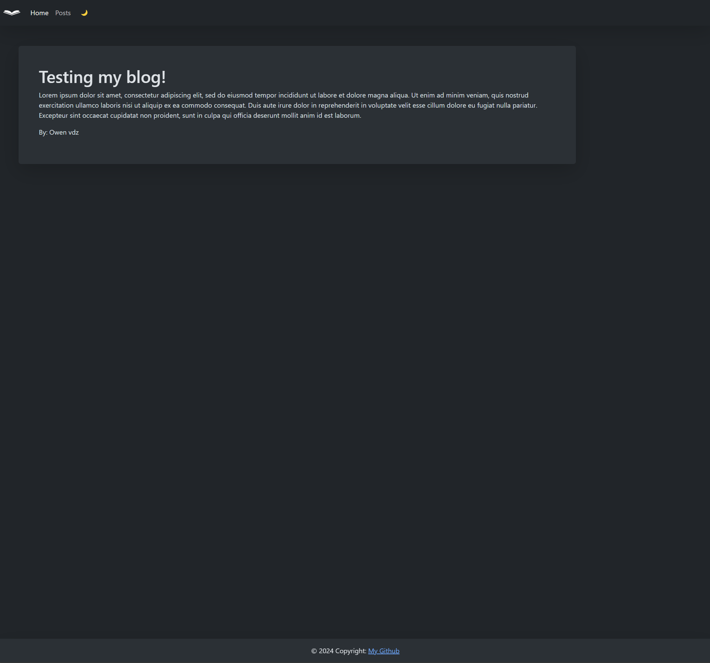

# 04 Web APIs: Personal Blog

## Description
A website which allows the user to create a blog post with a Username, Title, and Content. The blog is stored in LocalStorage and rendered on the blog.html website. There is also a dark mode switch which carries over between pages.
## Links
[GitHub Repository](https://github.com/zwanner/04-Project-Blog)

[Live Demo](https://zwanner.github.io/04-Project-Blog)
## Screenshot

